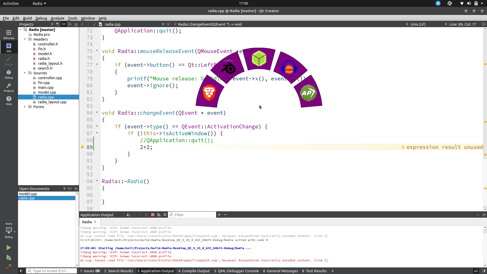

# Radia
## About
Radia is a new GUI for linux environments meant for ease of use and movement between form factors. It is designed to be used by any input source in a sensible and natural way. Currently it only exists as a incomplete program launcher.

## Requirements
Radia is built using `QT 5.15`. I would suggest using [QT creator.](https://www.qt.io/download)

## Theory
The idea behind this project to be usable on any device, in an intituive way. (Currently, it is only usable with a mouse, however this can be easily extended.) The circular design means the all icons are equally distant from each other. It also leads to an intuitive usage for game pads. For pointer devices, the launcher can be place around the pointer so that all icons are equal distance from the pointer.

## What's working
The launcher launches and apps launch when clicked

## What needs to be done
1. Pinned apps
2. Search
3. Other input methods
4. manipulate currently open programs
