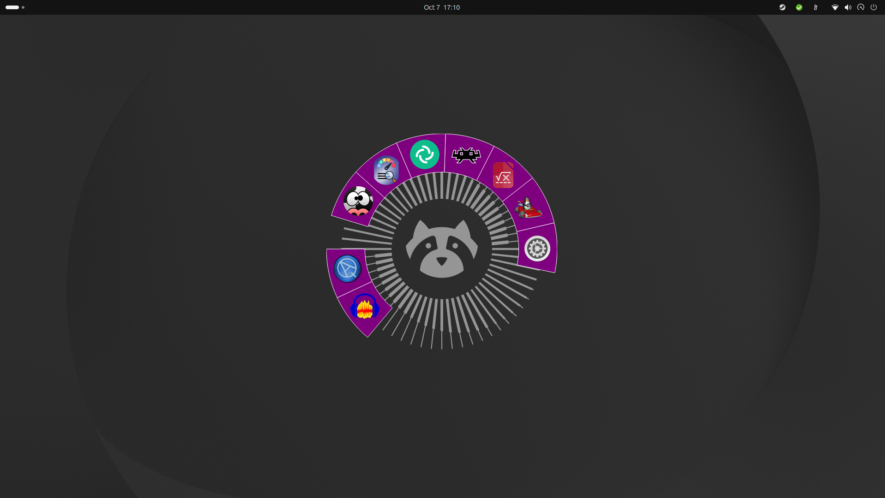

# Radia

## News (10/7/26)
Today marks an auspicious day! I have finished making this code work at the most basic level  that I want, therefore this marks the 
#### official Alpha Release v0.0.1
I am not releasing binaries, but it does have a release target. It does start and will launch a program. The carousels can be spun (click and drag) and apps can be pinned (3 right clicks). If you are interested, please download it and try it out!
## About
Radia is a new GUI for linux environments meant for ease of use and movement between form factors. It is designed to be used by any input source in a sensible and natural way. Currently it only exists as a incomplete program launcher.

## Requirements
Radia is built using `QT 6.12`. I would suggest using [QT creator.](https://www.qt.io/download) as it is still very much in development, but it can be built from source by first installing the required libraries `sudo apt install qt5-qmake qtbase5-dev libqt5svg5-dev`

Then run

`mkdir build`

`cd build`

`qmake ../Radia.pro`

`make -j$(nproc)`

`./Radia`

## Theory
The idea behind this project to be usable on any device, in an intituive way. (Currently, it is only usable with a mouse, however this can be easily extended.) The circular design means the all icons are equally distant from each other. It also leads to an intuitive usage for game pads. For pointer devices, the launcher can be place around the pointer so that all icons are equal distance from the pointer.

## What's working
The launcher launches and apps launch when clicked.
Pinned apps (kinda)

## What needs to be done
4. A center widget
2. Search
3. Other input methods
4. manipulate currently open programs
